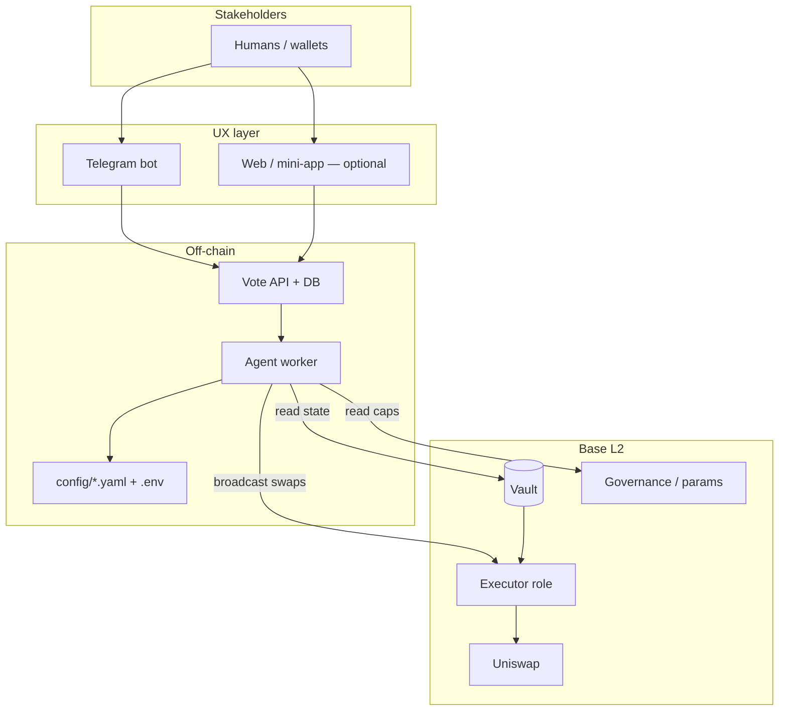
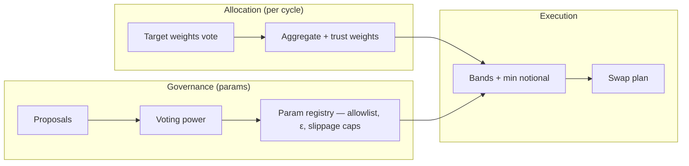
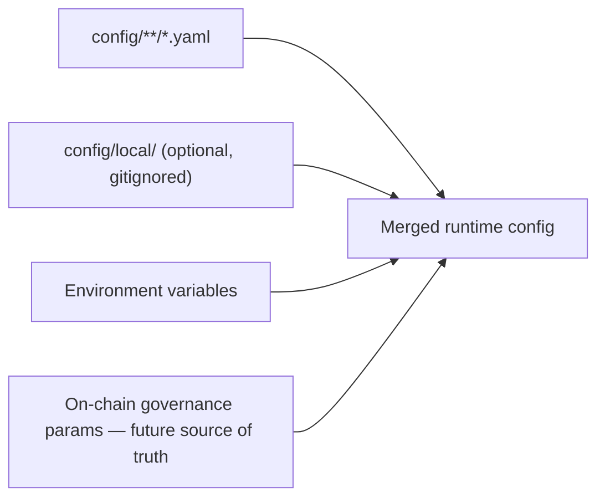

# Project structure

How the **DAO Agent** repo and runtime pieces fit together. For product behavior see [`docs/PROJECT_SPEC.md`](docs/PROJECT_SPEC.md).

---

## Repository map

**Today (in repo)**

```
Synthesis_Hack/
├── README.md                 # Judge / contributor entry point
├── STRUCTURE.md              # This file
├── LICENSE                   # MIT
├── .env.example              # Secret *names* only; copy to .gitignored `.env`
├── .gitignore
├── .github/workflows/        # Foundry CI + apps/agent CI
├── frontend/                 # Vite dashboard (port 1337): reads, deposit, TEST swap path — frontend/README.md
├── config/                   # Non-secret YAML defaults (see config/README.md)
│   ├── agent/                # Worker loop, execution limits
│   ├── chain/                # Base metadata, contract env keys
│   ├── dex/                  # Uniswap defaults
│   ├── rebalancing/          # Drift bands (ε), min notional
│   ├── governance/           # Quorum / timelock defaults (off-chain staging)
│   ├── trust/                # Trust v0 parameters
│   ├── telegram/             # Bot transport & UX knobs
│   ├── integrations/         # e.g. Synthesis catalog URL
│   ├── logging/
│   └── security/             # Allowed chain IDs, key env var names
└── docs/
    ├── PROJECT_SPEC.md       # MVP, mechanics, backlog
    ├── GOVERNANCE_VOTING.md # How params vs allocation votes work
    ├── BUILD_LOG.md         # Chronological build narrative
    ├── BUILD_CHECKLIST.md   # Ordered tasks to submission
    └── DEPLOY.md             # Base Sepolia deploy + agent wiring
```

**In progress**

```
vault/
├── spec.md                   # Vault technical intent (on-chain behavior)
└── checklist.md              # Implementation checklist

contracts/                    # Foundry — `src/DAOVault.sol`, tests, deploy script
frontend/                     # Vite React dashboard — NAV, deposit, Users; TEST = WETH→USDC swap + USDC deposit (see frontend/README.md)
apps/agent/                   # Node (viem): `plan` | `aggregate` | `trust` | `quote` — see apps/agent/README.md
apps/agent/skills/            # Agent task playbooks: rebalancing, execution (rebalance tx)
apps/bot/     (optional)     # Telegram webhook / long-poll service
```

---

## System architecture (runtime)

On-chain **Base**, off-chain **agent** orchestrates execution; **Telegram** is UX only.



---

## Allocation & rebalance flow (conceptual)

```mermaid
sequenceDiagram
  participant U as Stakeholders
  participant UX as Telegram / Web
  participant DB as Votes + DB
  participant A as Agent
  participant V as Vault
  participant D as Uniswap

  U->>UX: Submit allocation votes (cycle)
  UX->>DB: Persist votes + weights
  A->>DB: Load votes; compute trust-weighted target
  A->>V: Read holdings / share supply
  A->>A: Apply band rules — skip if drift < ε
  alt Drift out of band
    A->>D: Swaps within gov slippage / allowlist
  else In band
    A->>A: Log skip (no micro-swap)
  end
```

---

## Governance vs execution



---

## Configuration resolution

When the agent runs, settings are merged in this order (see [`config/README.md`](config/README.md)):



Once the vault stores governance values on-chain, **chain wins** over file defaults for those keys.

---

## Related links

- [`README.md`](README.md) — quick start and disclaimer  
- [`frontend/README.md`](frontend/README.md) — dashboard (port 1337), Deposit + **TEST** swap path  
- [`docs/DEPLOY.md`](docs/DEPLOY.md) — Base Sepolia deploy + configure  
- [`docs/PROJECT_SPEC.md`](docs/PROJECT_SPEC.md) — MVP and rebalance bands §2.1  
- [`docs/GOVERNANCE_VOTING.md`](docs/GOVERNANCE_VOTING.md) — two vote streams  
